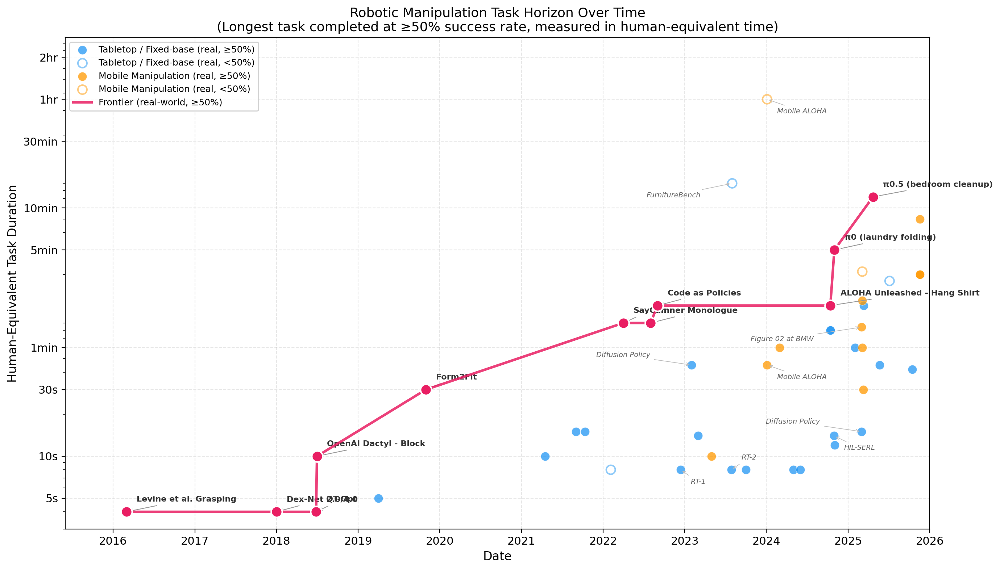

# Robot Manipulation Task Horizon

**A METR-style analysis of how the longest task robotic manipulation systems can reliably complete has grown over time.**



## Overview

Inspired by [METR's task horizon analysis](https://metr.org/blog/2025-03-19-measuring-ai-ability-to-complete-long-tasks/) for LLM agents, this project tracks the **longest manipulation task** that a robot can complete at ≥50% success rate, measured in human-equivalent time, from 2016 to 2025.

Key findings:
- The real-world manipulation task horizon is **doubling every ~14.9 months** (R²=0.92, N=11)
- This is ~2.1x slower than METR's LLM agent findings (~7 months), closer to self-driving (~20 months)
- The ≥50% frontier was carried by short tabletop tasks (Form2Fit kit assembly, 30s, 2019) through to SayCan-class multi-step kitchen tasks (90s+, 2022) before foundation-model VLAs pushed it past 5-minute household tasks in 2024–2025
- The field went from 5-second grasps (2016) to 10-minute household tasks (2025)
- Many viral robot demos (e.g., autonomous cooking) were actually teleoperated — rigorous success rate tracking matters

## Structure

```
data/
  manipulation_horizons.csv   # 47 systems with success rates, human times, sources
  analysis_results.json       # Computed doubling times and fit statistics
scripts/
  plot_horizons.py            # Generate all visualizations
  analyze.py                  # Exponential fitting and statistical analysis
draft/
  blog_post.md                # Full blog post draft
figures/
  main_horizon_plot.png       # Main frontier plot
  robot_vs_llm_comparison.png # Comparison with METR LLM data
  category_comparison.png     # Tabletop vs mobile manipulation
  sensitivity_thresholds.png  # Sensitivity to success threshold
research_plan.md              # Detailed research methodology
```

## Usage

```bash
pip install matplotlib numpy pandas scipy
python scripts/plot_horizons.py    # Generate plots
python scripts/analyze.py          # Run analysis
```

## Contributing

If you know of a robotic manipulation system we missed, or have better data for an existing entry, please open an issue or PR. We especially welcome:
- Published human completion times for tasks in the dataset
- Success rates from controlled evaluations (vs. demos)
- Systems from 2020–2023 that pushed the frontier on multi-step manipulation
