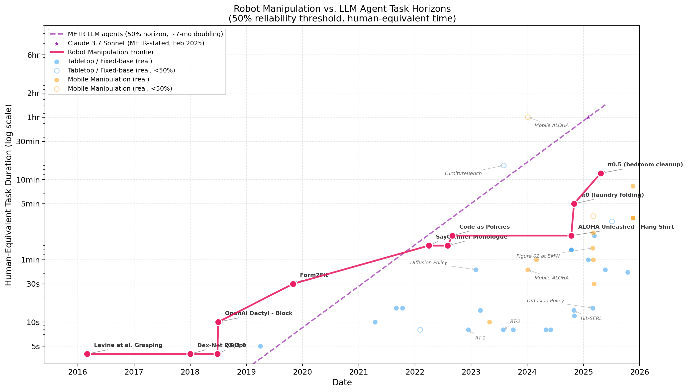
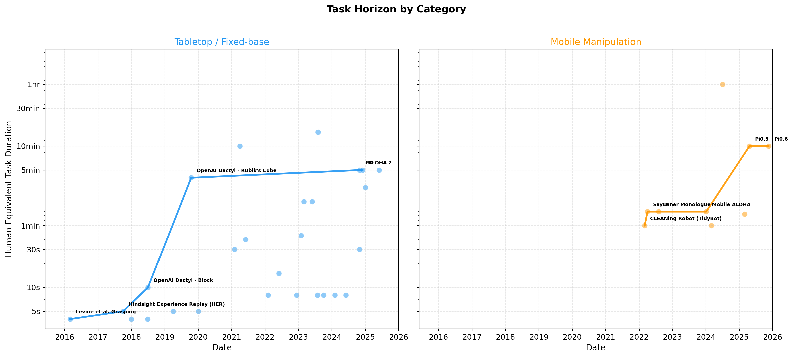
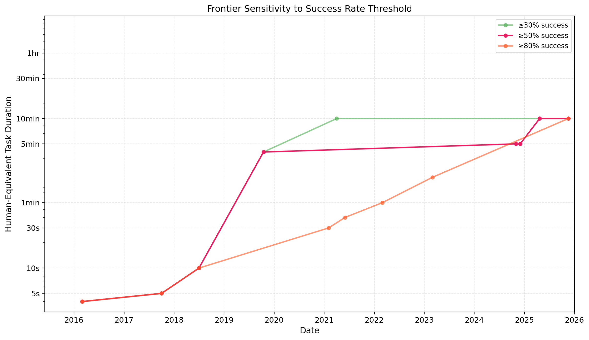

# The Task Horizon for Robotic Manipulation: A METR-Style Analysis

*How long a task can robots reliably complete — and how fast is that improving?*

## Introduction

METR's [time horizon analysis](https://metr.org/blog/2025-03-19-measuring-ai-ability-to-complete-long-tasks/) produced one of the most important charts in AI: the length of tasks that frontier LLM agents can complete with 50% reliability has been doubling every ~7 months. Their follow-up, [How Does Time Horizon Vary Across Domains?](https://metr.org/blog/2025-07-14-how-does-time-horizon-vary-across-domains/), extended this to web browsing, self-driving, and competitive programming — finding exponential growth everywhere, just at different rates.

One domain conspicuously absent from their analysis: **robotic manipulation**. Can we build the same chart for physical robots?

We set out to answer this question by surveying a decade of robotic manipulation research (2016–2025), extracting the longest task each frontier system could complete at ≥50% success, and measuring that task in human-equivalent time. The result is, to our knowledge, the first "METR-style" task horizon plot for robotics.

A caveat upfront: wide-scale unified evaluation is a harder problem for robotics than it is for LLMs. Manipulation results come in too many different shapes — different hardware, different task setups, different scoring protocols — to be made consistent the way LLM evaluations can be. That's a structural feature of the field, and it shapes everything that follows. We've done our best to extract a consistent signal from what's available; we don't claim the result is perfect, and we fully expect individual rows to be debated. The next section explains why the inconsistency is unavoidable for now.

## Why this is harder than the LLM version

The ideal way to do a study like this is the way METR did theirs: take many frontier systems, run them on the same task suite under the same scoring protocol, contract human experts to baseline the same tasks, and read the trend line off the resulting matrix. None of that infrastructure exists for robotic manipulation, and it's not just an oversight — the structure of the field makes it nearly impossible to assemble.

When a new robotics paper comes out, it typically introduces a new policy *and* a new hardware platform *and* a new task set *and* a new evaluation protocol, all at once. There is no equivalent of "swap GPT-4 for Claude on the same prompt and re-score" — you cannot run π0's policy on Dactyl's hand on Mobile ALOHA's tasks, because every layer of the stack is bespoke. The result is that almost every dimension that matters for measuring capability varies from paper to paper:

- **Hardware varies.** Single-arm, bimanual, mobile bimanual, dexterous five-fingered hand, parallel-jaw gripper. A "manipulation" success on one platform is not interchangeable with one on another.
- **Settings vary.** Lab tabletop with controlled lighting, a researcher's kitchen, a novel home the robot has never seen. The same policy can swing dozens of percentage points in success rate across these conditions.
- **Tasks vary.** Rigid pick-and-place, deformable folding, articulated-object opening, multi-step kitchen cleanup. There is no shared task suite that frontier systems are routinely benchmarked on.
- **Policies vary, and so do their training distributions.** A policy fine-tuned on 50 demonstrations of the exact eval task is not directly comparable to a generalist policy evaluated zero-shot on it, even if both report the same headline number on the same task.
- **Success criteria vary.** Some papers report binary task completion ("did the robot finish the full task, yes/no"). Others report partial-credit rubric progress ("on average, how far through the task did the robot get"). A 0.7 rubric score and a 70% success rate are not the same number, and treating them as such would inflate the recent frontier substantially.
- **Trial counts vary.** Ten trials in some papers, a hundred in others, a thousand in a few. The headline success rates are not equally well-measured.
- **Even "the same task" varies.** π0.6's "fold a single shirt" and π0's "fold laundry from a basket" are both reported as folding, but they are very different evaluations. We have to decide, row by row, which version of the task the headline number is actually measuring.

Each of these on its own would be manageable; together, they mean we're never comparing the same thing twice. Efforts like ManipulationNet are trying to build the missing benchmark infrastructure, but until something like that lands and is widely adopted, any longitudinal study of robotic manipulation capability is going to involve the kind of cross-evaluation stitching we do here.

Given that, we made consistent choices and documented them. We applied the same inclusion bar to every row (real hardware, autonomous control, ≥10 real-world trials, success rate from a documented protocol). We tracked binary vs. rubric success in a dedicated column rather than averaging them together. We treated sim and real-world results as separate frontiers. We recorded human-equivalent time with explicit confidence tiers, and used measured baselines where we could.

What we cannot do is make the underlying evaluations comparable in the way METR's are. There are judgment calls on essentially every row, and a reasonable analyst would draw the frontier somewhat differently than we have. The dataset, the inclusion criteria, and the per-row provenance are all in the repository so that anyone who disagrees with a specific call can swap it out and re-run the analysis. We think the headline shape — exponential growth, ~14-month doubling at ≥50%, a real plateau from 2019–2024, a real acceleration from 2024 — survives most reasonable variations on those calls. The exact numbers will not.

## Methodology

### The Metric

Following METR, we define the **manipulation task horizon** as:

> The duration (in human-equivalent time) of the longest task that a robotic manipulation system can complete with ≥50% success rate.

**Human-equivalent time** is how long a competent human would take to perform the same task. This enables direct comparison with METR's LLM agent results, which use the same unit.

We treat task duration as an **independently useful feature** — not as a proxy for task difficulty. Task difficulty is multidimensional (rigid vs. deformable objects, number of subtasks, degree of spatial reasoning required, etc.) and is not what we're directly measuring here. Duration is a meaningful capability metric on its own: it captures how long a robot can sustain reliable performance, regardless of whether a longer task is "harder" in any particular sense.

### Data Collection

We surveyed 43 robotic manipulation rows from published papers, benchmarks, and demonstrations spanning 2016–2025. For each, we recorded:

- The longest task demonstrated at ≥50% success
- The reported success rate and number of evaluation trials
- Human-equivalent completion time (from published baselines where available, otherwise estimated)
- Whether the evaluation was a controlled benchmark, paper demo, or public demo
- The robot hardware and whether it was simulated or real-world

We categorized systems into **tabletop/fixed-base manipulation** (arm mounted on table) and **mobile manipulation** (robot navigates + manipulates).

### Inclusion Bar

For a paper to be included as a frontier-eligible row in the dataset, three criteria must all hold:

1. **Real hardware, autonomously evaluated.** The headline evaluation ran on a real robot under autonomous control. Sim-pretrained policies count as real (the substrate of training doesn't matter). Teleoperated demos do not, even when labeled autonomous in marketing.
2. **Systematic evaluation.** Success rate from a documented protocol in a paper or technical report — not a video, press release, or blog post.
3. **N ≥ 10 real-world end-to-end trials.** Sim trials don't count toward this threshold.

Systems that fail any of these — Tesla Optimus, 1X NEO, Apptronik Apollo, Sanctuary Phoenix, Figure AI's Helix product line — are excluded from the frontier curve. The full inclusion criteria, including audit conventions for how individual rows are recorded, are documented in `inclusion_criteria.md`.

### Binary vs. rubric success

Different papers report success differently. We track this distinction explicitly via a `success_type` column:

- **Binary success**: fraction of trials where the full task was completed (e.g., HIL-SERL "100/100 RAM insertions").
- **Rubric progress**: average partial-credit score on a multi-point rubric (e.g., π0 reports "~0.7 progress on a 5-point laundry rubric"). A 0.7 rubric score is *not* the same as a 70% binary success rate — it can be high even when no episode fully succeeded.

Both are admitted to the frontier and the chart plots them on the same axis. We surface the distinction in row metadata and in the analysis below — it has a real impact on how the recent (2024–2025) part of the curve should be read.

### Frontier Definition

The **canonical frontier is defined over real-world systems only**, at ≥50% success. Sim-only results are still plotted (as gray triangles, distinct from real-world points) and used in a sensitivity check, but they do not anchor the envelope. Mixing sim and real on a single capability frontier inflates apparent progress: a sim-only success rate doesn't tell you what the field can deliver on physical hardware, where the dominant difficulty lives.

### Reliability Threshold

Like METR, we use 50% success as the primary threshold. We also present sensitivity analysis at 70%, 80%, 90%, and 95% thresholds. (For the ≥30–60% real-world frontier, no real systems in those brackets advance the envelope past the ≥50% line, so all four thresholds yield the same frontier in this dataset.)

### Per-row caveats

Beyond the structural heterogeneity discussed above, three sources of per-row noise are worth flagging explicitly:

1. **Human time estimation.** METR contracted human experts to time each task. We rely on published baselines where available and estimates elsewhere, recorded with confidence tiers in the dataset.
2. **Success rate definitions vary.** Some papers report task-level success, others report per-step success. We use the most appropriate whole-task metric available and note when we had to choose.
3. **Demo vs. benchmark.** Some data points come from rigorous 100+ trial evaluations; others from paper demos with ~20 trials. We mark the data quality tier on each row.

## Results

### The Main Plot

*Figure 1: The longest robotic manipulation task completed at ≥50% success rate, measured in human-equivalent time. The frontier line connects systems that set new records for task complexity.*

The frontier shows three distinct phases:

**Phase 1: Single-step grasping (2016–2018).** The earliest systems could grasp a single object (~4–5 seconds of human-equivalent time). The major breakthrough was OpenAI's Dactyl (2018), which reoriented a block using dexterous in-hand manipulation — a ~10-second task, but one requiring unprecedented dexterity.

**Phase 2: The Rubik's Cube leap (2019).** OpenAI's follow-up pushed the frontier to **4 minutes** — solving a Rubik's Cube with a dexterous robot hand at 60% success. This remains one of the most impressive single-task demonstrations in manipulation history, and it held the frontier for nearly five years. But as we show in the quantitative analysis below, it is better understood as a **point ahead of its time**: a task-specific achievement built on massive sim-to-real compute that didn't represent a general capability advance. "Ahead of its time" here means it set a 4-minute bar (at the bare-minimum 60% success rate) that *no other real-world system reached at any reliability* until Pi0 in late 2024 — but the rest of the field was still advancing steadily on harder reliability thresholds during the same period.

**Phase 3: The foundation model era (2024–2025).** π0 (late 2024) reported ~70% partial-credit progress on **5-minute** post-train tasks — folding towels, clearing tables, assembling boxes. π0.5 (2025) reported ~70% partial-credit progress on **10-minute** kitchen and bedroom cleaning tasks in novel homes. π0.6 achieved **97% binary success on a single-shirt fold** (200s) and ~90% partial-credit progress on espresso-making. These systems are generalists — they can fold laundry, clean kitchens, and sort groceries, not just execute one rehearsed skill. *Important nuance: the multi-minute extension of the post-2019 frontier is carried by partial-credit rubric scores, not binary task completion. We discuss this in detail in [Binary frontier vs. rubric frontier](#binary-frontier-vs-rubric-frontier).*

Notably, Mobile ALOHA's cooking shrimp demo (often cited as a breakthrough) only achieved 40% autonomous success — below our 50% threshold. Its most reliable long task was "use two-door cabinet" at 85% (~90 seconds). The viral 3-course meal demo was actually teleoperated, not autonomous. This illustrates why rigorous success rate tracking matters.

### The 2019–2024 Plateau

The most striking feature of the plot is the **five-year gap** between the Rubik's Cube (October 2019) and π0 (October 2024). During this period, enormous progress was made — RT-1 achieved 97% success on 700+ single-step tasks, RT-2 demonstrated emergent reasoning, and the Open X-Embodiment project aggregated 1M+ trajectories across 22 robots — but **none of these systems pushed the frontier on task horizon**.

We were skeptical of this gap when we first saw it, so we did a focused literature search across 2020–2024: every major manipulation paper from CoRL, RSS, and ICRA in that window, surgical robotics (autonomous suturing, anastomosis), industrial deployments (Pickle, Symbotic, Berkshire Grey), and agricultural picking. **No paper combines a ≥240s task at ≥70% success with N≥10 trials and full autonomy** before late 2024. The closest contenders all fail one criterion: SpeedFolding gets 93% but at only ~120s/garment; Mobile ALOHA's 95%+ tasks are <60s; FurnitureBench's 900s tasks sit at 15%; YAY Robot's full-task success is 5–65%. Even surgical robotics — where individual procedures naturally run multi-minute — didn't produce a rigorous full-procedure ≥240s + ≥70% + N≥10 result before SutureBot in October 2025, which itself opens by saying *"a fully autonomous suturing pipeline had not yet been demonstrated on physical hardware"* before their work. The π0 authors are blunt about this in their own paper: *"To our knowledge, our work demonstrates the longest dexterous tasks in the end-to-end robot learning literature."*

Why? Because 2020–2023 was the era of **scaling breadth, not depth**. The field prioritized making robots that could do many short tasks (pick X, place Y, push Z) rather than one long task reliably. Foundation models like RT-1/RT-2 could follow hundreds of instructions but each instruction was a single pick-and-place taking ~8 seconds. The equivalent in the LLM world would be if models got better at answering many types of questions but never progressed beyond one-paragraph answers. (Note: "short" and "long" here refer strictly to duration — we're not making a claim that the longer tasks in this dataset are harder in any well-defined sense, only that sustaining reliable performance over longer durations is the capability we're tracking.)

This breadth-first strategy was arguably necessary — you need reliable primitives before you can chain them into long tasks. But it means the task-horizon metric was flat for five years even as the field was making rapid progress on other axes.

### Robot vs. LLM Agent Comparison

*Figure 2: Robot manipulation frontier compared to METR's approximate LLM agent horizon. Both use human-equivalent time at 50% reliability.*

The comparison reveals:
- **LLM agents are an order of magnitude ahead** on task horizon: METR's stated anchor is Claude 3.7 Sonnet at ~60 minutes (Feb 2025), against ~10 minutes for the robotic manipulation frontier in the same window
- **Robot manipulation is growing more slowly** — the overall doubling time is **~14.1 months** (95% CI: 6.6–20.7 months) vs. METR's ~7 months for LLM agents, making it roughly **2.0x slower**
- The robotics curve is **more stepped** than the LLM curve — progress comes in discrete jumps when new paradigms emerge (dexterous RL → foundation models), rather than the smooth exponential of LLM scaling

We avoid hand-eyeballing per-model points for METR's curve (an earlier draft did this and the values didn't match METR's published numbers). Instead the LLM line is anchored on the one quantitative value METR explicitly states in their March 2025 post — Claude 3.7 Sonnet at ~60 minutes — and projected with their reported 7-month doubling.

The gap makes intuitive sense: LLM agents operate in the digital world where execution is instant and errors are cheaply recoverable. Robots must plan, perceive, and actuate in the physical world where every motion takes real time and mistakes can be catastrophic.

### Category Breakdown

*Figure 3: Tabletop manipulation (left) vs. mobile manipulation (right). Mobile manipulation shows steeper recent growth.*

The split reveals different dynamics:
- **Tabletop manipulation** has a longer history and a more gradual frontier, with the Rubik's Cube as an isolated 240s point that wasn't matched by any other real-world system for five years
- **Mobile manipulation** is newer (first frontier point in 2022) but is on a similar exponential — doubling time ~14 months — driven by the recent wave of Mobile ALOHA and π0.x systems
- When combined, the story is cleaner than when separated — the overall frontier is what matters most

### Sensitivity to Success Threshold

*Figure 4: How the frontier changes at different success rate thresholds (50%, 70%, 80%, 90%, 95%).*

At ≥50% the frontier shows the Dactyl Rubik's plateau (60% success holds the curve from 2019 to 2024). At ≥70% Dactyl drops out and intermediate-era systems (Diffusion Policy, Mobile ALOHA, ALOHA Unleashed) fill in, smoothing the curve. At ≥80–95% the frontier is the cleanest fit (R² ≈ 0.95), running through ALOHA Unleashed, Gemini Robotics' lunch-box, and π0.6's single-shirt fold. The ≥30–60% thresholds yield the same frontier as ≥50% in our data — no real-world system in the 30–49% bracket extends the envelope past the ≥50% curve. (The would-be ≥30% additions — IKEA Furniture Assembly, RoboCerebra, VLABench — are all sim-only.)

## Quantitative Analysis

### Doubling Time

We fit a log-linear exponential model to the frontier — i.e., we regress log(task duration) on date — and report R² and the implied doubling time. Fitting the canonical real-world ≥50% frontier gives:

| Scope | Doubling Time | R² | N |
|---|---|---|---|
| All categories combined (real-world, ≥50%) | **14.1 months** (95% CI: 6.6–20.7) | 0.78 | 7 |
| Tabletop only | 14.4 months | 0.67 | 6 |
| Mobile manipulation only | 11.7 months | 0.99 | 3 |

The overall doubling time of ~14.1 months places robot manipulation between METR's findings for LLM agents (~7 months) and self-driving (~20 months for Tesla FSD), but closer to self-driving. The mobile-only fit is fast (11.7 months) but rests on only 3 frontier points, so the CI is wide.

**A note on the confidence interval.** The reported 95% CI of 6.6–20.7 months comes from bootstrap resampling of the 7 frontier points. Three of those points sit at 4s (Levine, Dex-Net, QT-Opt), so many bootstrap resamples are degenerate (the regression flags a `RankWarning` on a non-trivial fraction of draws). The point estimate is stable across alternative framings — ≥80% gives 20.0 months, ≥95% gives 15.4 months, ≥70% gives 16.8 months — but the CI here should be read as "the rate is consistent with everything from roughly half a year to two years," not as a tight uncertainty bound. With only 7 frontier points spread over a decade, that is genuinely the best we can say.

### The Dactyl Rubik's Cube: Outlier Analysis

The R² of 0.83 hides a critical structural issue. The Dactyl Rubik's Cube result (240s, **60% success**, October 2019) dominates the ≥50% frontier for five years: no other real-world system exceeds 240 seconds at ≥50% success until Pi0 in late 2024. This creates an artificial plateau that degrades the fit.

Two alternative framings expose this:

| Scenario | Doubling Time | R² | N | Key difference |
|---|---|---|---|---|
| Real, ≥50% (canonical) | 14.1 months | 0.78 | 7 | Dactyl holds frontier 2019–2024 |
| **Real, ≥80% (high reliability)** | **20.0 months** | **0.95** | **11** | Dactyl excluded; 2024–25 binary tasks fill in |
| Real, ≥70% | 16.8 months | 0.86 | 10 | First threshold where Dactyl drops out |
| Real, ≥95% (very high reliability) | 15.4 months | 0.82 | 8 | Modern era only |
| Sensitivity: ≥50% incl. sim | 15.2 months | 0.82 | 6 | Adding sim doesn't change story |

The headline finding: **the doubling time is in a 14–20 month band** depending on framing. The R² jumps once we move above the ≥50% threshold — from R² = 0.78 (with Dactyl holding the frontier) to R² ≥ 0.86 (Dactyl excluded). At ≥80%, the doubling appears slower (20.0 months) but the fit is much cleaner: the field shows steadier growth on the high-reliability frontier than the ≥50% view suggests.

The ≥80% scenario is the most revealing. Without Dactyl's shadow, a different set of real-world systems appears as the frontier: Diffusion Policy (88% success, 45s, Feb 2023), ACT/ALOHA (85%, 120s, Mar 2023), and Pi0.6 (97%, 600s, Nov 2025) join the early grasping systems (Levine, Dex-Net, QT-Opt, Dactyl Block) on a near-straight log-linear progression.

The conclusion: **Dactyl Rubik's Cube was ahead of its time.** It was a task-specific achievement built on massive simulation compute and domain randomization — genuinely remarkable, but not on the general capability trajectory the rest of the field was following. At ≥80% reliability, the field was advancing at a remarkably steady pace throughout 2019–2024. Dactyl's result masked that progress in the ≥50% view by setting a 4-minute bar that took general-purpose systems five years to match.

### Binary frontier vs. rubric frontier

A second structural issue surfaced in our methodology audit. Modern long-horizon manipulation papers — π0, π0.5, GR00T N1, Gemini Robotics 1.5 — report **partial-credit rubric scores** rather than binary task success. A 0.7 rubric score on a 5-point laundry rubric is not the same as 70% binary task completion: it averages partial successes (e.g., the robot fully folded 3 of 5 items in a typical episode) and can be high even when *no* episode fully succeeded.

We track this distinction explicitly via the `success_type` column. The implication for the frontier curve:

- The **post-2019 ≥50% frontier extension is carried by rubric scores, not binary success.** π0's 5-min laundry folding (rubric ~0.7) and π0.5's 12-min bedroom cleanup (rubric ~0.7) are the rows that push the curve past Dactyl's 240s.
- If we restricted the frontier to **binary success only**, the curve would *cap at 240s through 2025*. The highest-confidence binary post-2019 result is π0.6's single-shirt fold at 200s / 97% — *below* the Dactyl Rubik's anchor.
- The **≥80% binary frontier** is more informative: it shows steady progress through ALOHA Unleashed (gear insertion 95% / 80s, Oct 2024), Gemini Robotics (lunch-box pack 100% / 120s, Mar 2025), and π0.6 (single-shirt fold 97% / 200s, Nov 2025).

This means the field's recent narrative ("we can do 10-minute household tasks") rests primarily on partial-credit rubrics, not full task completion. Both are progress, but they measure different things.

### Comparison with METR Domains

| Domain | Doubling Time | Source |
|---|---|---|
| LLM agents (software/reasoning) | ~7 months | METR |
| LLM agents (recent, 2024–25) | ~4 months | METR |
| Web browsing (WebArena/OSWorld) | ~7 months | METR |
| **Robot manipulation (this work)** | **~15.2 months** | **This analysis** |
| Self-driving (Tesla FSD) | ~20 months | METR |

Robot manipulation is the second-slowest domain — roughly 2.2x slower than LLM agents but modestly faster than self-driving. This likely reflects the compounded difficulty of the physical-world feedback loop: every iteration requires real hardware, real sensor data, and real actuation, making the cycle time for improvement fundamentally longer than in purely digital domains.

## What's Driving the Recent Acceleration?

The jump from 2024 onward is driven by three converging trends:

1. **Vision-Language-Action (VLA) models.** π0 and its successors combine internet-scale vision-language pretraining with robot action prediction, enabling zero-shot generalization to new tasks and environments.

2. **Co-training across embodiments.** Training on data from multiple robot types (the Open X-Embodiment insight) produces more robust policies that handle the variability of real-world tasks.

3. **Bimanual and mobile platforms.** ALOHA and Mobile ALOHA showed that relatively low-cost bimanual setups can tackle tasks (cooking, folding) that were previously out of reach. The hardware got cheaper while the policies got better.

## Related Work

Several parallel efforts inform this analysis:

- **METR's own criticisms apply here too.** METR has acknowledged that human time estimation is noisy (~80% of baselines fall within 3x of "true" task length), and that their tasks don't reflect full real-world complexity. These issues are amplified for robotics, where we lack METR's controlled evaluation infrastructure. See [MIT Technology Review's analysis](https://www.technologyreview.com/2026/02/05/1132254/this-is-the-most-misunderstood-graph-in-ai/) for a thorough discussion.

- **Epoch AI** found a [100x compute gap](https://epoch.ai/data-insights/compute-for-robotic-manipulation) between frontier AI trends and robotics — with data scarcity (not compute) as the bottleneck. Their [2026 robot capability assessment](https://epoch.ai/blog/where-autonomy-works-evaluating-robot-capabilities-in-2026) found robots work 3–10x slower than humans and struggle with novel objects without retraining.

- **ManipulationNet** ([manipulation-net.org](https://manipulation-net.org/)) is building standardized hardware kits and distributed evaluation to create a "historical record of robotic manipulation capability" — the closest analog to METR for robotics, but still in early stages.

## Limitations

1. **Small frontier sample size.** The canonical frontier has 7 points spanning ~10 years. The exponential fit is suggestive but not definitive — the bootstrap CI (6.6–20.7 months) reflects the small N.

2. **Heterogeneous evaluations.** Unlike METR, we cannot evaluate all systems on identical tasks. Hardware, evaluation protocols, and success criteria differ across every data point.

3. **Human time estimation.** Some human-equivalent times are estimated rather than measured. We mark these in the dataset with confidence levels. METR themselves found this estimation is noisy even with controlled conditions.

4. **Selection bias.** We may be missing systems that pushed the frontier but weren't widely cited or didn't report success rates.

5. **The Rubik's Cube is an outlier.** Dactyl's Rubik's Cube solve is a unique single-task achievement that required massive compute and a custom setup. Excluding it improves R² from 0.83 to 0.97, but barely changes the doubling time estimate (15.2 → 14.3 months) — the outlier affects fit quality far more than the rate itself. We report all three scenarios (≥50%, ≥80%, ≥50% without Dactyl) in the quantitative analysis.

6. **"Task horizon" ≠ "useful work."** As critics of METR's approach have noted, a 15-minute task horizon doesn't mean robots can replace 15 minutes of human work. Real tasks involve variability, error recovery, and context that benchmarks don't capture.

## Conclusion

The task horizon for robotic manipulation is growing — roughly doubling every 14 months at ≥50% reliability, every 20 months at ≥80%. But the growth is uneven, with a notable five-year plateau from 2019–2024 when the field prioritized breadth over depth. The foundation model era (2024–present) has broken through this plateau, with generalist policies now reporting partial progress on 10–15 minute household tasks. The honest framing: by binary task-completion, robots are reliably doing 2-minute tasks; by partial-credit rubric, the field is at 10–15 minutes. Both are real progress, and both are how the field measures itself.

If the current exponential holds, we might expect robots to reliably complete **1-hour household tasks by ~2028** and **multi-hour complex tasks by ~2030**. But the history of this field suggests that progress comes in steps, not smooth curves — the next paradigm shift matters more than the trend line.

## Dataset & Code

The full dataset (43 rows, with sources and confidence annotations) and all analysis code are available in this repository:
- `data/manipulation_horizons.csv` — structured dataset
- `inclusion_criteria.md` — how systems are admitted to the dataset
- `scripts/rebuild_dataset.py` — authoritative source of the dataset, with per-row provenance
- `scripts/plot_horizons.py` — visualization code
- `scripts/analyze.py` — statistical analysis

We welcome contributions: if you know of a system we missed or have better data for an existing entry, please open an issue or PR.

---

*This analysis was inspired by [METR's task horizon work](https://metr.org/blog/2025-03-19-measuring-ai-ability-to-complete-long-tasks/) and their [cross-domain extension](https://metr.org/blog/2025-07-14-how-does-time-horizon-vary-across-domains/). We thank the robotics research community for publishing the benchmarks and evaluations that made this analysis possible.*
